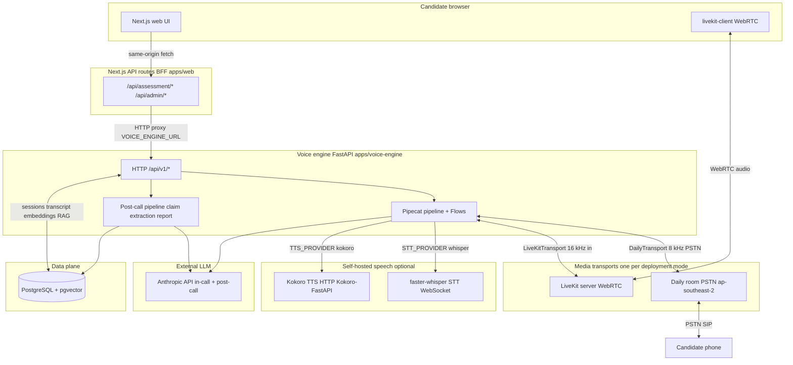

# Platform architecture — wire diagram (voice, data, and APIs)

This document is a **single-page wiring view** of how the main deployable pieces connect: the **Next.js web app**, **Next.js API routes** (BFF), the **voice engine** (FastAPI + Pipecat), **media transports** (Daily PSTN vs LiveKit browser), **self-hosted STT/TTS** (faster-whisper, Kokoro), **external LLM** (Anthropic), and **PostgreSQL with pgvector**. It complements [voice-interview-systems-architecture.md](voice-interview-systems-architecture.md) (audio loop detail) and [ADR-001](adr/ADR-001-hexagonal-architecture.md) / [ADR-004](adr/ADR-004-voice-engine-technology.md) / [ADR-005](adr/ADR-005-rag-vector-store-strategy.md).

**Defaults vs options:** Production often uses **Deepgram** (STT) and **ElevenLabs** (TTS). The diagram below emphasises the **self-hosted path** (`STT_PROVIDER=whisper`, `TTS_PROVIDER=kokoro`) requested for this wire view; cloud providers occupy the same slots in the Pipecat pipeline when enabled.

---

## 1. Mermaid — system wiring



**How to read the edges**

| From | To | What crosses the wire |
|------|-----|-------------------------|
| Web UI | Next.js `/api/*` | JSON: create candidate, trigger call, status, cancel, admin lists. |
| Next.js API | Voice engine `:8000` | Server-side `fetch` to `VOICE_ENGINE_URL` (e.g. `/api/v1/assessment/trigger`, `/status`). |
| Voice engine | PostgreSQL | `DATABASE_URL`: sessions, candidates, transcript turns, `skill_embeddings` / RAG queries (pgvector). |
| Pipecat | Daily or LiveKit | Bot participant media; candidate audio is either PSTN via Daily or browser WebRTC via LiveKit. |
| Pipecat | faster-whisper | WebSocket streaming STT when `STT_PROVIDER=whisper`. |
| Pipecat | Kokoro | HTTP streaming TTS when `TTS_PROVIDER=kokoro`. |
| Pipecat / post-call | Anthropic | In-call dialogue and tool use; after the call, claim extraction and holistic scoring (separate API usage from the live audio path). |

---

## 2. ASCII wire diagram (deployment-centric)

```
                                    ┌─────────────────────────────────────┐
                                    │     External: Anthropic API        │
                                    │  (in-call LLM + post-call LLM)     │
                                    └──────────────▲──────────▲──────────┘
                                                   │          │
┌──────────────┐    HTTPS (browser)    ┌──────────┴──────────┴──────────┐
│  Candidate   │ ────────────────────►│   Next.js (apps/web)           │
│  browser     │   same-origin /api/*   │   Web UI + API route handlers  │
└──────┬───────┘                        └──────────────┬─────────────────┘
       │                                                 │
       │ WebRTC (browser mode only)                      │ HTTP proxy
       │ livekit-client                                  │ VOICE_ENGINE_URL
       ▼                                                 ▼
┌──────────────┐                        ┌────────────────────────────────┐
│  LiveKit     │◄──── bot + human ─────►│  Voice engine (FastAPI)        │
│  server      │      WebRTC media      │  Pipecat: transport in/out     │
└──────────────┘                        │       ↓ ↑                      │
                                        │  STT (faster-whisper WS)       │
       OR PSTN                          │       ↓ ↑                      │
       ▼                                │  Flows + LLM context           │
┌──────────────┐                        │       ↓ ↑                      │
│  Daily       │◄──── bot media ───────│  TTS (Kokoro HTTP)             │
│  + PSTN      │      + dial-out        └──────────┬─────────────────────┘
└──────┬───────┘                                   │
       │                                           │ SQL + vector queries
       ▼                                           ▼
┌──────────────┐                        ┌────────────────────────────────┐
│  Phone       │                        │  PostgreSQL + pgvector         │
│  network     │                        │  sessions, transcripts, RAG      │
└──────────────┘                        └────────────────────────────────┘
```

**Daily vs LiveKit:** `DIALING_METHOD=daily` uses Daily for both room and PSTN; `DIALING_METHOD=browser` uses LiveKit for WebRTC while the Next.js status payload can expose `browserJoinUrl` / LiveKit tokens for the candidate page.

---

## 3. Pipecat pipeline slot (logical bus)

Regardless of transport, the **same Pipecat-shaped chain** applies: transport feeds audio into **STT**, conversation logic and **LLM** (with optional **RAG** from pgvector), then **TTS** back to the transport.

```
  [DailyTransport | LiveKitTransport]
            │
            ▼
  [STT: faster-whisper ── or ── Deepgram]
            │
            ▼
  [Flows / aggregators / LLM processors]
            │                    ┌──► pgvector (skill definitions) ──┐
            │                    └── RAG context into prompts ─────┘
            ▼
  [TTS: Kokoro ── or ── ElevenLabs]
            │
            ▼
  [DailyTransport | LiveKitTransport]
```

---

## 4. References

- [docker-compose.yml](../../docker-compose.yml) — Postgres (pgvector), optional `whisper-stt`, optional `kokoro-tts`, voice-engine env wiring.
- [docs/guides/local-setup.md](../guides/local-setup.md) — `STT_PROVIDER`, `TTS_PROVIDER`, LiveKit, `VOICE_ENGINE_URL`.
- [PHASE-3-Revision-3-self-hosted-providers.md](implemented/v0.5/PHASE-3-Revision-3-self-hosted-providers.md) — STT/TTS factory behaviour and fallbacks.
