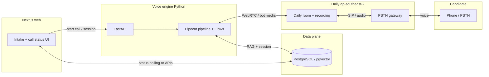
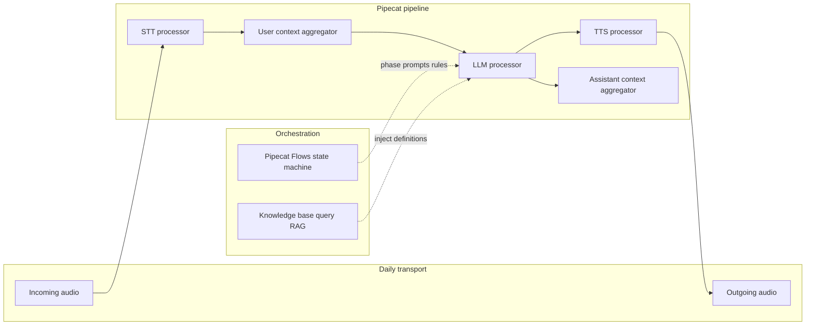
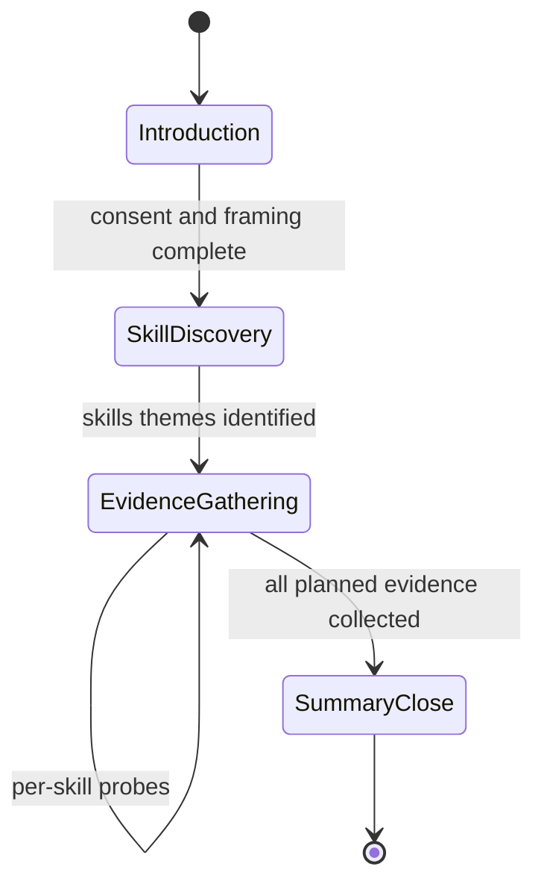
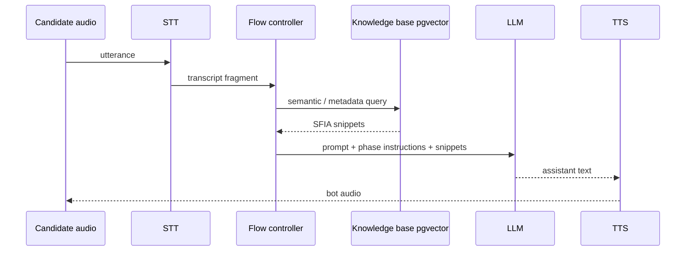
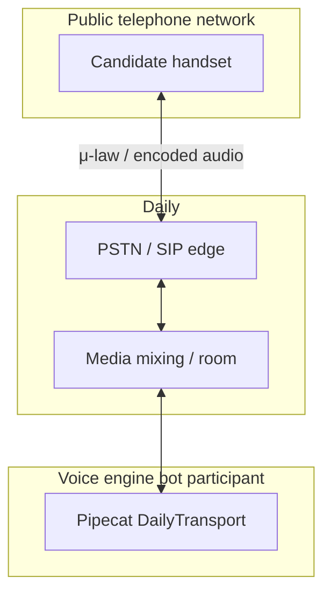
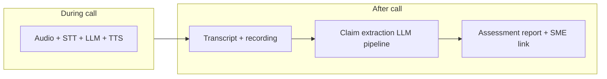

# Voice Interview: AI, Speech, and Voice Systems

This document explains how telephony, speech, and AI components work together to run a **real-time voice interview** for the Voice-AI SFIA Skills Assessment Platform. It aligns with [PRD-001](prd/PRD-001-voice-ai-sfia-assessment-platform.md), [PRD-002](prd/PRD-002-assessment-interview-workflow.md), and [ADR-004](adr/ADR-004-voice-engine-technology.md).

---

## 1. High-level picture

At the highest level, the interview is a **closed loop** between the candidate’s phone, a **telephony transport** (Daily in Sydney), and a **voice engine** that runs a **Pipecat** pipeline: audio in → speech-to-text → language model → text-to-speech → audio out. A **flow controller** (Pipecat Flows) drives which questions to ask and when to move between interview phases. The LLM is grounded with **retrieved framework text** (RAG) so questions stay aligned with SFIA definitions. After the call, a **separate** post-call pipeline turns the transcript into claims and reports; that is not part of the live audio loop.

**In one sentence:** Daily carries bidirectional audio to/from the phone; Pipecat streams that audio through STT → LLM (+ RAG context) → TTS while a state machine steers the conversation.

---

## 2. System context (who talks to whom)

The candidate completes intake in the **web app** (Next.js). The app asks the **voice engine** (FastAPI) to start a call. The voice engine joins a **Daily** room, dials the candidate via **PSTN**, and runs the Pipecat pipeline against that session. **PostgreSQL** (and pgvector, per ADR-005) backs session state and the knowledge base the LLM queries during the interview.



**Wire-style ASCII (same relationships):**

```
  [Browser / Next.js]          [Voice engine : FastAPI]
         |                              |
         |  HTTP: start assessment     |
         +----------------------------->|
         |                              v
         |                    [Pipecat + Flows + STT/LLM/TTS]
         |                              |
         |                              | WebRTC / bot participant
         v                              v
  [Status from DB/API]            [Daily room]
                                        |
                                        | PSTN / SIP
                                        v
                                   [+61 phone]
```

---

## 3. Real-time audio and AI pipeline (the interview loop)

During the call, **raw audio** from Daily enters the pipeline. **STT** turns it into text; **context aggregators** maintain conversation history for the LLM. The **LLM** decides what the bot should say next, optionally influenced by **RAG** snippets from the knowledge base. **TTS** turns the reply into audio frames sent back through Daily to the candidate. Pipecat’s **frame** model allows urgent prompts (for example, a timed interjection) to be injected as high-priority TTS.



Conceptual ordering (from ADR-004):

| Stage | Role |
|--------|------|
| **Transport input** | Pulls candidate audio from the call |
| **STT** | Streaming speech-to-text |
| **User context** | Buffers user turns for the LLM |
| **LLM** | Generates the assistant’s next utterance using history + system prompt + RAG |
| **TTS** | Converts assistant text to speech |
| **Transport output** | Sends bot audio to the candidate |
| **Assistant context** | Records what the bot said for coherence |

**Events:** `UserStartedSpeaking` / `UserStoppedSpeaking` (and related hooks) support behaviours such as silence handling or the interview’s interjection timing rules described in PRD-002.

---

## 4. Conversation steering (Flows vs pipeline)

Two layers cooperate:

1. **Pipeline** — continuous **media and cognition**: audio ↔ text ↔ model ↔ speech.
2. **Flows** — **business conversation structure**: which phase the interview is in, what kinds of questions to ask, and when to transition.



The flow controller selects **system prompts**, **tooling**, or **branch logic** appropriate to the phase (for example, open discovery vs level-specific SFIA probes). The LLM still runs every turn; the flow **constrains intent and transitions**, not the low-level codecs.

---

## 5. RAG during the interview (why the bot sounds “on-framework”)

The knowledge base (conceptually the **KnowledgeBase** port; physically **pgvector** in PostgreSQL per ADR-005) stores **chunked framework text** keyed by skill and level. While the candidate speaks, the engine can **query** with keywords or detected skill labels and **inject** short retrieved passages into the LLM context so follow-up questions reference official wording without the model memorising the whole framework.



This loop is **soft real-time**: latency stacks across STT, retrieval, LLM, and TTS, which is why region choice (Sydney) and streaming APIs matter.

---

## 6. Telephony path (how the phone participates)

For a **phone interview**, Daily acts as the **bridge** between the public telephone network and WebRTC media used by the bot:



Daily also provides **recording** and optional **transcription logging** for audit; the product still relies on the pipeline STT for **live** understanding and generation.

---

## 7. What happens after the call (boundary)

The **live interview** ends when the transport hangs up and the recording is finalised. **Claim extraction**, skill codes, confidence scores, and SME-ready reports run in **downstream services** using the stored transcript (see PRD-002). That processing **does not** sit inside the STT → LLM → TTS loop and can use larger, batch-style LLM calls.



---

## 8. Summary table

| System | Technology (planned) | Responsibility |
|--------|----------------------|----------------|
| Web / intake | Next.js | Collect candidate details; show call status |
| Call control API | FastAPI | Start sessions, health, optional status |
| Media + PSTN | Daily (`ap-southeast-2`) | Rooms, dial-out, recording, low-latency audio |
| Orchestration | Pipecat + Flows | Pipeline wiring and interview state machine |
| Speech in | STT adapter (e.g. Deepgram / Google) | Real-time transcription |
| Reasoning | LLM adapter | Dialogue and question generation |
| Speech out | TTS adapter | Spoken bot replies |
| Grounding | RAG over pgvector | SFIA-aligned snippets per turn or phase |
| Persistence | PostgreSQL | Sessions, embeddings, status |

---

## References

- [ADR-004: Voice Engine Technology](adr/ADR-004-voice-engine-technology.md)
- [ADR-005: RAG & Vector Store](adr/ADR-005-rag-vector-store-strategy.md)
- [PRD-001: Platform overview](prd/PRD-001-voice-ai-sfia-assessment-platform.md)
- [PRD-002: Interview workflow & post-call extraction](prd/PRD-002-assessment-interview-workflow.md)
